# 뉴하(NEWSHI)


## **👨‍👨‍👧‍👦팀원 소개**


🦁천창민 [@chunawoos](https://github.com/chunawoos)

🐱조성국 [@likelionSungGuk](https://github.com/likelionSungGuk)

🐶백태훈 [@whiteburnout](https://github.com/whiteburnout)

🐭김재승 [@kimjaeseung](https://github.com/kimjaeseung)

🐼김재성 [@JS-2](https://github.com/JS-2)


## 📑 프로젝트 소개

- **진행기간**: 2021.01.11 ~ 2021.02.19

- **웹사이트 이름**: 뉴하(NewsHi)

- **목표**
    - URL복사로 편리하게 기사 스크랩하기
    - 여러 기사를 한 번에 공유할 수 있는 통합 공유링크 생성
    - 누구나 큐레이터가 될 수 있는 플랫폼
    - 큐레이터가 모아놓은 기사를 통해 원하는 기사만 모아 볼 수 있는 플랫폼
    - 모바일에서 편리하게 사용할 수 있는 플랫폼
  
- **슬로건**: 소셜 뉴스 큐레이션 플랫폼


## ⚙️ 개발환경

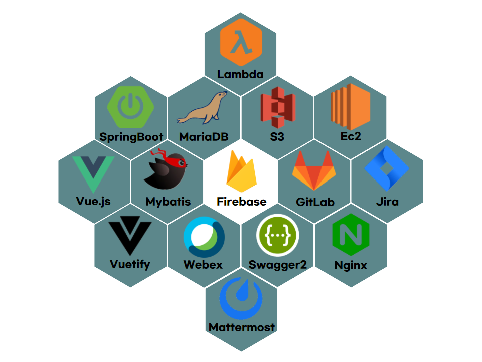</img>

## 📜개발기록

- [회의록](./Documents/회의록)
- [와이어프레임](./Documents/WireFrame)
- [발표자료](./Documents/발표자료)
- [컨벤션](./Documents/Convention)
- [UCC](./Documents/UCC)


## 🛠️설치

### Frontend

1. 설치

```bash
$ npm -i
or 
$ yarn -i
```

2. 실행

```bash
$ npm serve
or 
$ yarn serve
```

### Backend

1. Gradle build
2. Maria DB 테이블 생성
   - database_9.mwb
3. Application Properties 설정


## 🕹️주요 기능

- **뉴스피드**
    
    >메인페이지
    
    - 구독중인 큐레이터들의 게시 포스트 목록 조회
    - 관심 태그로 큐레이터 추천
    - 최신 포스트 조회
    
- **포스트 조회**
    
    >큐레이터의 기사 스크랩
    
    - 기사 본문 및 이미지
    - 요약된 기사 본문
    - 큐레이터의 의견
    - 기사 본문 소리로 듣기
    - 좋아요/싫어요
    - 나중에 볼 기사 저장
    
- **채널**
    
    > 큐레이터의 개인 페이지
    
    - 큐레이터 구독 기능
    - 큐레이터의 포스트 목록
    - 커뮤니티 게시판
    
- **검색**
    
    - 해시태그 검색
    - 큐레이터 검색
    
- **마이페이지**
    
    - 구독중인 큐레이터 목록
    - 프로필 사진
    - 관심 분야 태그 목록 조회 / 수정
    
- **회원 관리 기능**
    - 회원가입 (카카오톡, 구글)
    - 로그인/로그아웃
    - 비밀번호 찾기(변경)
    
-  **다크모드**

- **유저의 개선사항 요구 (CS) 메일링 기능 제공**

## 🙈 페이지 소개

### 뉴스피드

- 로그인

  > 큐레이터 추천기능과 구독중인 큐레이터의 포스트

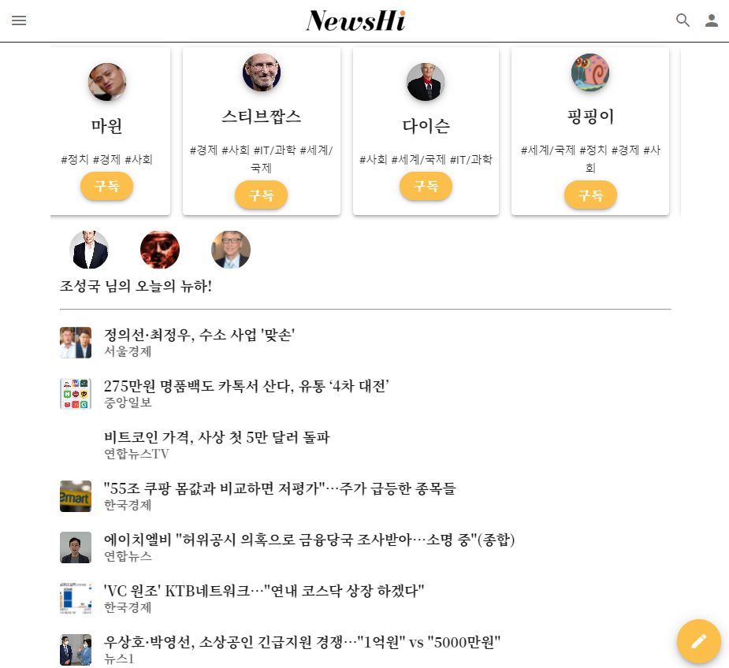</img>

---

- 비로그인

  > 최신순으로 등록된 기사를 보여줌
  
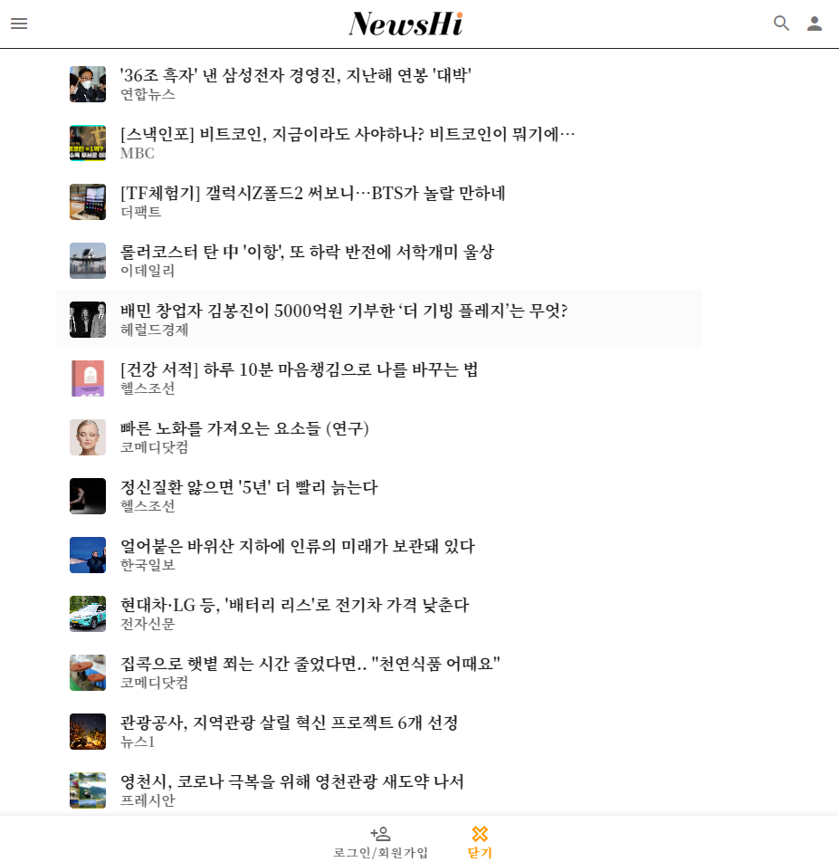</img>
---

### 포스트
> 본문, 요약된 기사, 큐레이터 의견
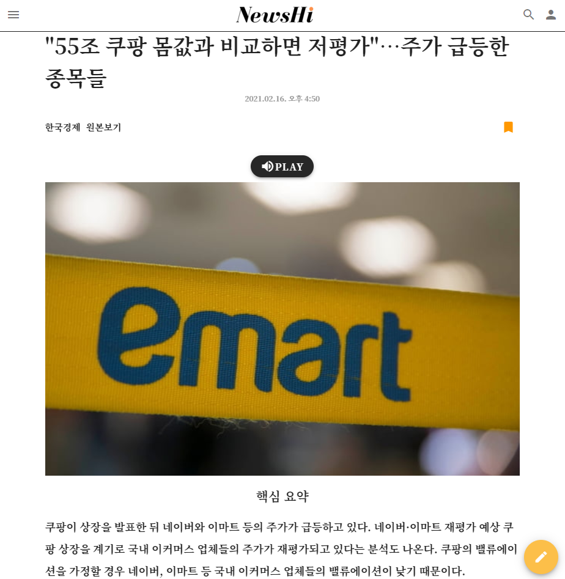</img>
---
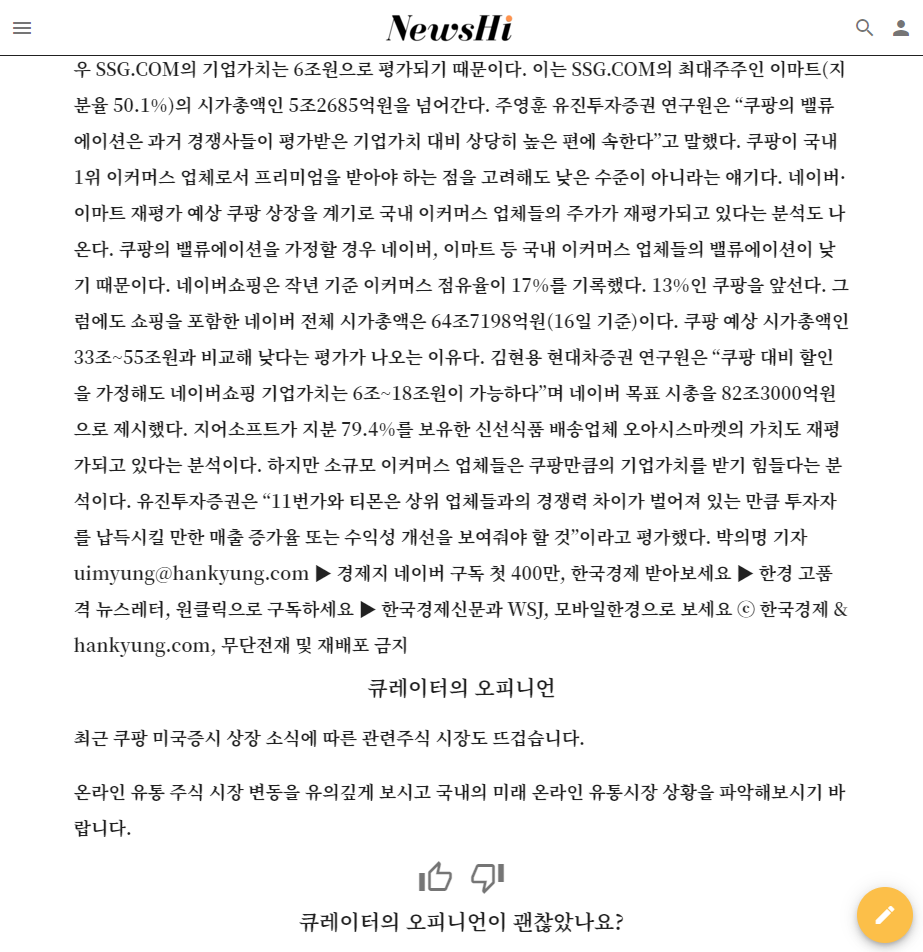</img>
---

### 다크모드
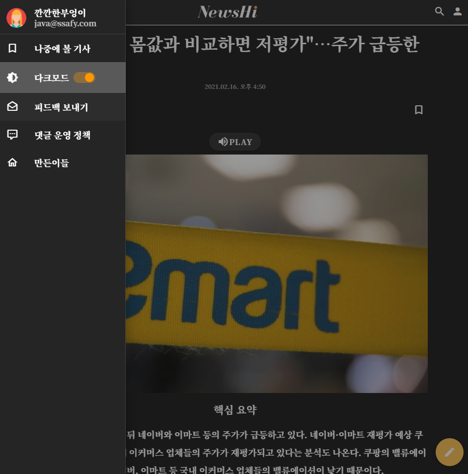</img>
---

### 마이페이지
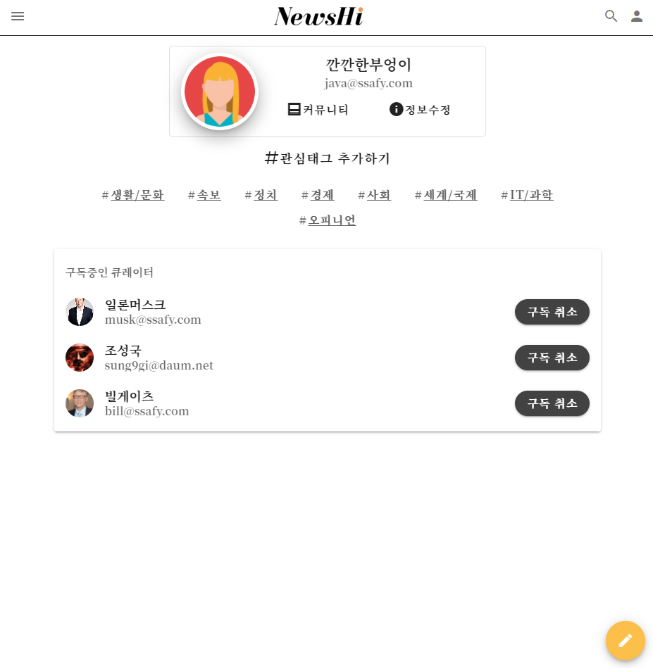</img>
---

### 입력
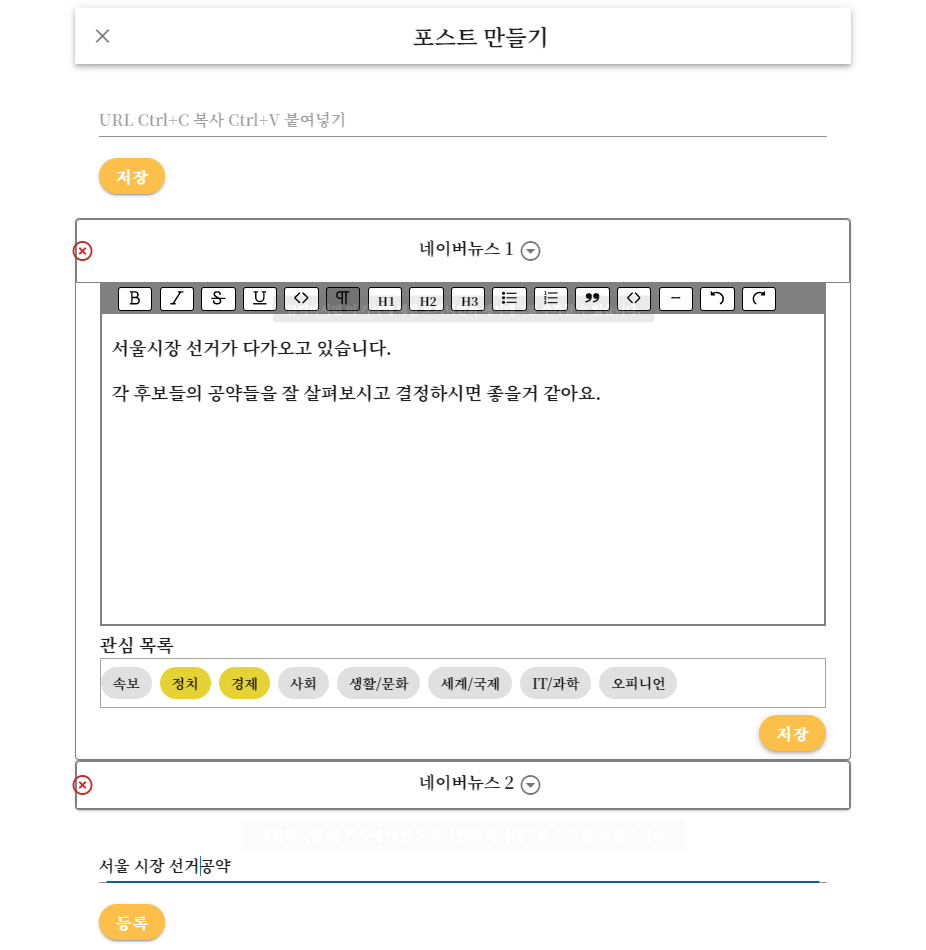</img>
---

### 채널
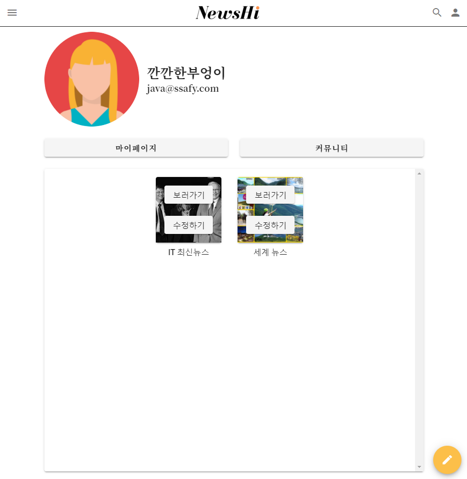</img>
---
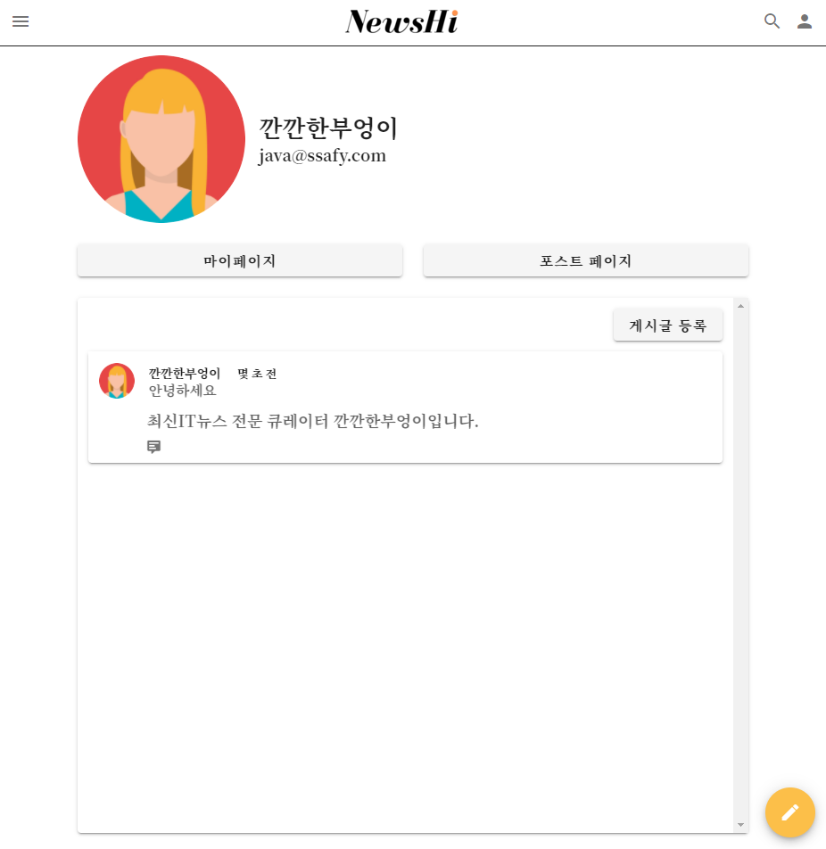</img>
---

### 검색

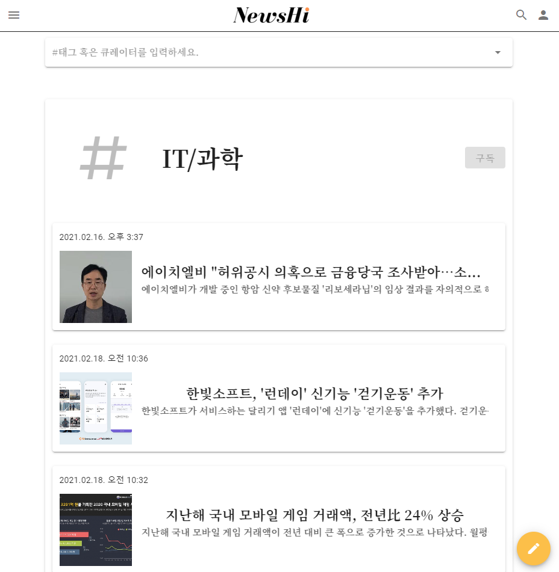</img>
---
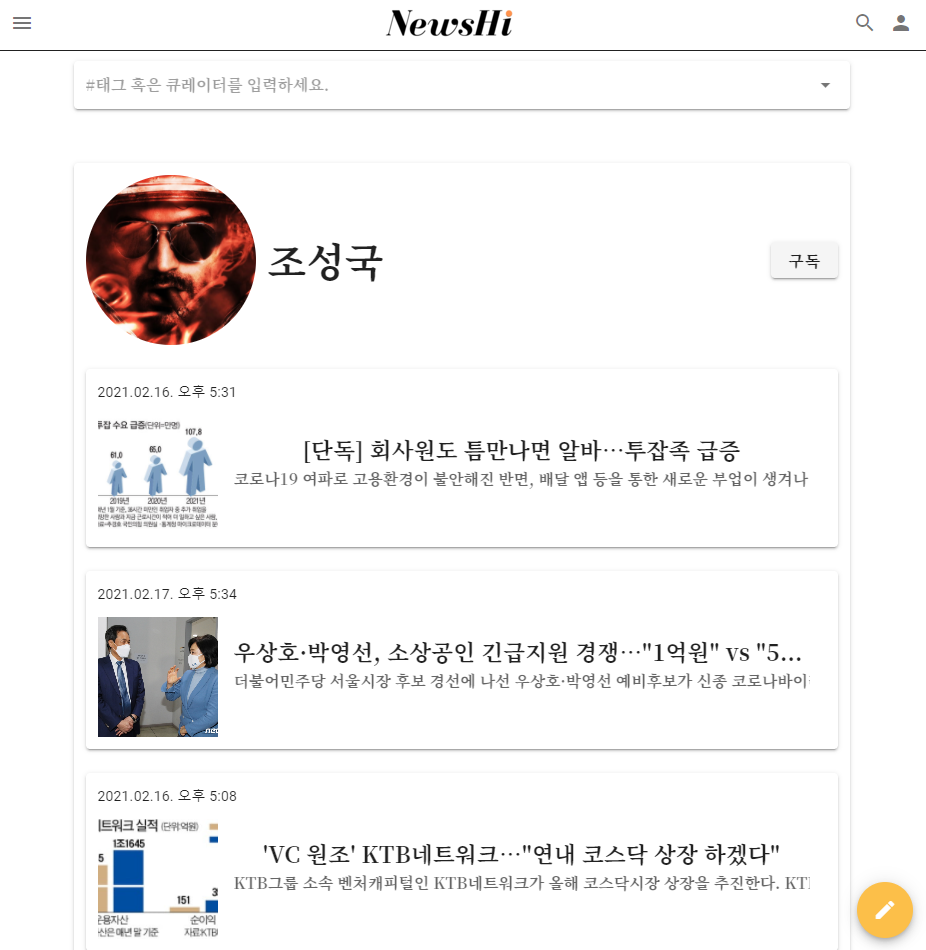</img>

---
